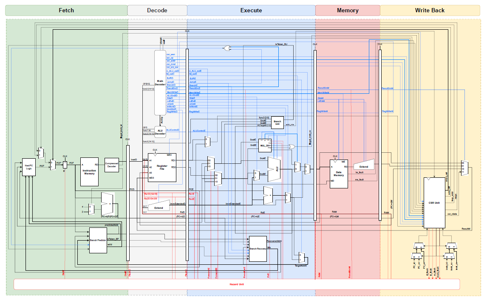

# RISC-V RV64IMAC RTL Design using SystemVerilog HDL
Welcome to the RISC-V RV64IMAC RTL Design repository! This project represents our graduation work from the Electronics and Communication Engineering program at Alexandria University, Egypt. Our goal was to create an RTL implementation of a 64-bit RISC-V architecture capable of running a Linux-based operating system, complete with Level-1 caches and privilege modes.

## Team Members
1. [Aly Elruby](https://github.com/AlyElruby)
2. [Ali Khaled](https://github.com/AKhaled47)
3. [Mohamed Maged](https://github.com/MuhammadMajiid)
4. [Haythem Shaban](https://github.com/Hythem-shaban)
5. [Mohamed Morsi](https://github.com/mohamedmorsi22)
6. [Ziad Taha](https://github.com/ziadtaha4)
7. [Moahemed Tareq](https://github.com/mohamed-mohamed-tarek)
8. [Nsreen Nashaat](https://github.com/Nsreen-Nashaat)
9. [Basmala Eldabaa](https://github.com/Basmala-Eldabaa)
10. [Ahmed Hamdi](https://github.com/Hamdiess)

## Overview
The RISC-V ISA is defined as a base integer ISA, which must be present in any implementation, along with optional extensions to the base ISA. Our design adheres to the RV64IMAC specification, which includes integer instructions, multiplication and division (M), atomic instructions (A), and compressed instructions (C). Additionally, we’ve incorporated privilege modes to enable secure execution of privileged instructions.

## Repository Contents
* RV64IMAC Microarchitecture.
* RTL design using SystemVerilog HDL src files.
* FPGA Implementation src files.
* ASIC Implementation Reports and GDS file.
* Documentation of the Project.

## Objective
1. Specification: Determine RISC-V extensions to be capable of running Linux-based OS.
2. Microarchitecture: Design a 5-stage pipelined RV64I microarchitecture and then include the required extensions (M, A, and C).
3. RTL: Implement RTL design for RV64IMAC including privilege ISA and level 1 caches.
4. Verification: Verify and test our design using RISCV-DV.
5. Prototyping: Prototype our design on Kintex-7 KCU105 FPGA.
6. ASIC: Perform ASIC flow on our RTL design.

## Microarchitecture Design
Our microarchitecture is divided into two interacting parts: the datapath and the control unit. The datapath operates on double-words of data. It contains structures such as memories, registers, ALUs, and multiplexers. We are implementing the 64-bit RISC-V architecture, so we use a 64-bit datapath. The control unit receives the current instruction from the datapath and tells the datapath how to execute that instruction. Specifically, the control unit produces multiplexer select, register enable, and memory write signals to control the operation of the datapath. 
Firstly, we designed a single cycle microarchitecture of base integer instructions (RV64I) then we applied pipelining and added a hazard unit to handle dependencies between simultaneously executing instructions and finally we include M, A, C extensions.

## RTL Implementation
The RTL implementation of our RV64IMAC is divided into the design of the blocks of each stage including level 1 caches and CSR unit, pipes, and the top module. 
## Verification
Verification of our design is performed on RISCV-DV which is an open source environment provided by CHIPS Alliance. 
## Prototyping
FPGA prototyping of the designed RV64IMAC is performed on KCU105 FPGA.
## ASIC
ASIC Implementation including gate level synthesis, formal verification, design for test (DFT), and placement and routing (PNR) is done using synopsys tools.

